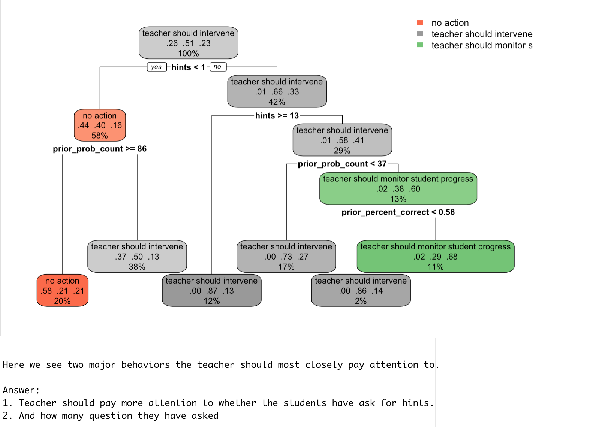

# Decision-Tree-predicting-student-teacher-Action
Learning Analytics

For this assignment we have used data from the Assistments Intelligent Tutoring system.

This system gives students hints based on how they perform on math problems. We want to see if we can build a decision tree to help teachers decide which students to follow up with, based on students' performance in Assistments. We will create three groups ("teacher should intervene", "teacher should monitor student progress" and "no action") based on students' previous use of the system and how many hints they use. To do this we will be building a decision tree using the "party" package. The party package builds decision trees based on a set of statistical stopping rules.

We have build two trees, one classification, one regression

